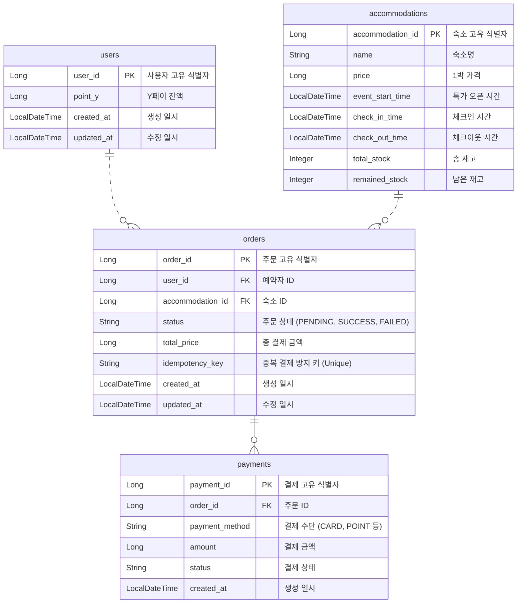
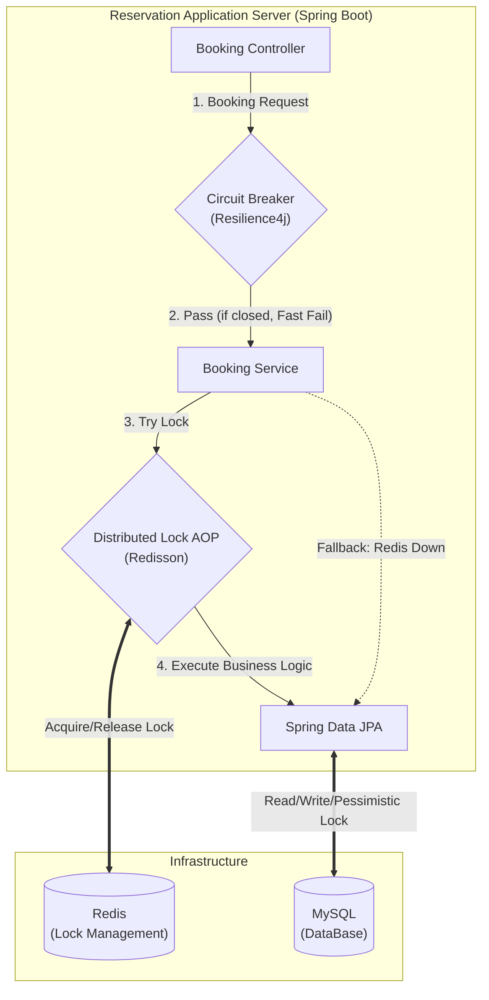
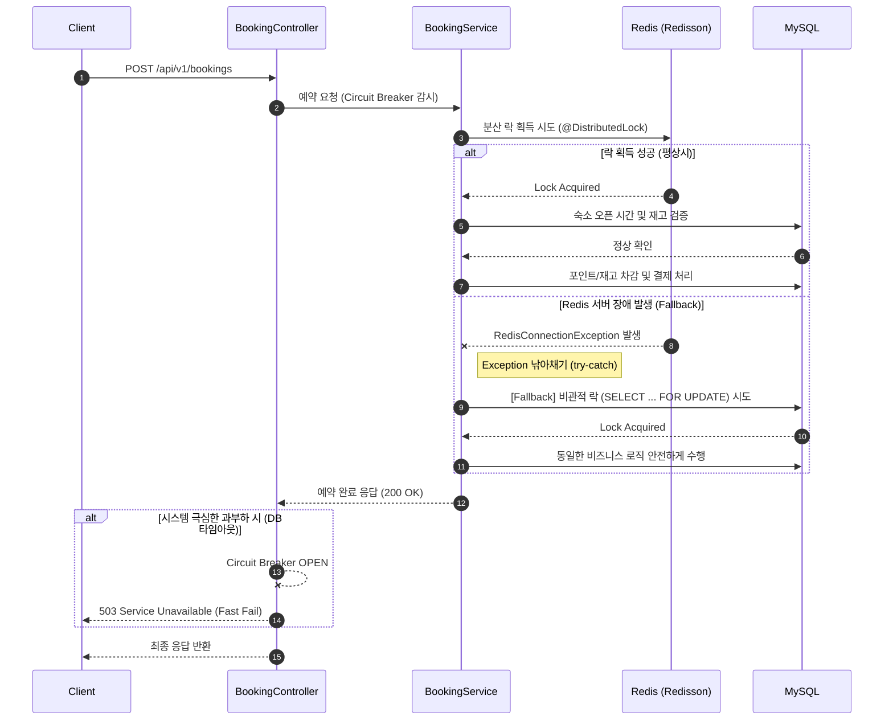

# 선착순 예약 시스템
> 본 프로젝트는 대용량 트래픽 환경에서도 선착순 예약을 처리하는 백엔드 시스템 데모입니다.

## 프로젝트 개요
- **목적:** 대규모 트래픽이 예상되는 선착순 예약 시스템
- **주요 기능:** 숙소 예약, 결제 처리, 재고 관리, 장애 대응
- **특징:** Redis 기반 분산 락으로 동시성 제어, Resilience4j로 장애 대응, MySQL로 데이터 일관성 보장
- **대상 사용자:** 숙소 예약 플랫폼 개발자, 시스템 아키텍트, 백엔드 엔지니어

## 기술 스택
* **Language & Framework:** Java 17, Spring Boot 3.x
* **Database:** MySQL, Spring Data JPA
* **Cache & Lock:** Redis, Redisson (Distributed Lock)
* **Architecture & Reliability:** Resilience4j (Circuit Breaker)

## ERD
### 1. Schema Description
* **`users` (사용자)**
   * `user_id` (PK): 사용자 고유 식별자
   * `point_y`: 보유 포인트 (Y페이 잔액)
   * `created_at`, `updated_at`: 생성/수정 일시

* **`accommodations` (숙소)**
   * `accommodation_id` (PK): 숙소 고유 식별자
   * `name`: 숙소명
   * `price`: 가격
   * `event_start_time`: 특가 예약 오픈 시간 (선착순 검증용)
   * `check_in_time`, `check_out_time`: 체크인/체크아웃 시간
   * `total_stock`: 총 재고 수량
   * `remained_stock`: 남은 재고 수량

* **`orders` (주문/예약)**
   * `order_id` (PK): 예약 고유 식별자
   * `user_id` (FK): 예약자 ID
   * `accommodation_id` (FK): 예약한 숙소 ID
   * `total_amount`: 총 결제 금액
   * `status`: 예약 상태 (PENDING, SUCCESS, FAILED)

* **`payments` (결제 내역)**
   * `payment_id` (PK): 결제 고유 식별자
   * `order_id` (FK): 연관된 주문 ID
   * `payment_method`: 결제 수단 (CARD, POINT 등)
   * `amount`: 결제 금액
   * `status`: 결제 처리 상태 (SUCCESS, FAILED)

### 2. ERD Diagram


## 시스템 아키텍쳐


## 시퀀스 다이어그램


## 실행 방법(테스트 가이드)
> 스프링 부트 서버 구동 시 `data.sql`을 통해 테스트를 위한 기본 데이터가 자동 세팅됩니다. <br>
> 외부 툴(Postman 등)을 통해 즉시 테스트가 가능합니다. **`테스트하는 유저의 PK는 1입니다.`**
> 
> * **환경 변수:** 본래 `.env` 파일은 보안상 Git에 올리지 않는 것이 원칙이나, 원활하고 빠른 로컬 테스트 환경 구축을 위해 환경 변수는 암호화하지 않았습니다.
> * **JPA ddl-auto (create):** 즉각적인 테스트가 가능하도록 `create` 모드로 설정했습니다. 애플리케이션 구동 시 자동으로 테이블이 생성되며, `data.sql`이 실행되어 기본 더미 데이터가 세팅됩니다.
### 1. 인프라 실행 (Docker compose)
프로젝트 루트 디렉토리에서 아래 명령어를 실행하여 `MySQL`과 `Redis` 컨테이너를 백그라운드에서 구동합니다.
```bash
docker-compose up -d
```

### 2. 어플리케이션 실행
Spring Boot 애플리케이션을 구동합니다. 구동이 완료되면 data.sql을 통해 아래의 테스트 데이터가 자동으로 세팅됩니다.
- 테스트 유저: userId = 1 (보유 포인트: 100,000 Y페이)
- 테스트 숙소: accommodationId = 1 (가격: 50,000원, 총 재고: 10개, 현재 시간 기준 예약 오픈 상태)

### 3. API 테스트 방법
1. 숙소 목록 확인 (테스트 ID 확보)
   - `GET /api/v1/accommodations`
   - 반환된 1번 숙소의 eventStartTime이 현재 시간 이전인지 확인합니다.

2. 체크아웃 정보 조회 
   - `GET /api/v1/accommodations/1/checkout?userId=1`

3. 예약 요청 (JSON Body)
   - `POST /api/v1/bookings`
```json
{
  "userId": 1,
  "accommodationId": 1,
  "idempotencyKey": "uuid-test-001",
  "payments": [
    {
      "method": "CARD",
      "amount": 50000
    }
  ]
}
```

## 상세 문서 모음 (Docs)

설계 의도와 상세한 트러블 슈팅 과정은 아래 문서에서 확인하실 수 있습니다.

* **[시스템 설계를 위한 트레이드오프 분석 (DECISIONS.md)](docs/DECISIONS.md)** : 과제 요구사항 분석 
* **[API 명세서 (API_SPEC.md)](./docs/API_SPEC.md)** : 전체 API 엔드포인트 및 요청/응답 스펙
* **[테스트 코드 설명 (TEST_REPORT.md)](./docs/TEST_REPORT.md)** : 테스트 시나리오 설명 및 캡쳐
