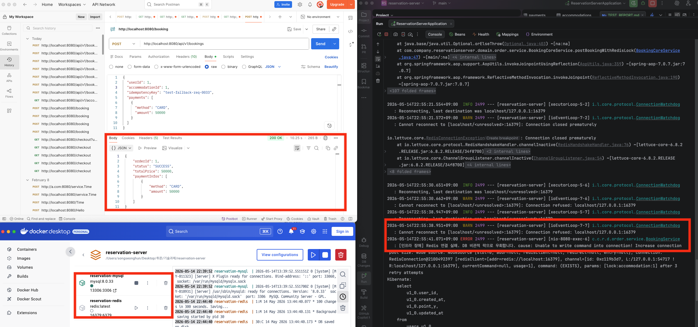

# 시스템 검증 및 테스트 리포트

본 프로젝트는 대규모 트래픽 환경에서의 안정성을 보장하기 위해, 핵심 비즈니스 로직에 대한 단위 테스트부터 멀티 스레드 환경의 통합 테스트, 그리고 인프라 장애 시뮬레이션까지 철저한 검증을 거쳤습니다.
> 2, 3번(멱등성, 동시성) 테스트 DB와 Redis가 구동되고 있어야 가능한 테스트 코드를 작성했습니다.\
> 4번(Fallback) 테스트는 캡쳐본을 참고부탁드립니다. 

## 1. 단위 및 API 테스트 (Unit & Controller Test)
* **목적:** 비즈니스 규칙(재고 부족, 결제 수단 혼용 불가 등) 및 API 예외 처리 검증
* **검증 내용:**
    * `@WebMvcTest`를 활용하여 `controller`의 요청/응답 스펙 및 `@Valid` 검증 확인
    * 존재하지 않는 유저, 재고 소진 등의 예외 발생 시 400, 404, 409 등의 상태 코드가 정상 반환됨을 확인
    * `CheckoutService`, `BookingService`의 핵심 비즈니스 로직을 Mocking하여 독립적으로 검증 완료

## 2. 대규모 트래픽 동시성 검증 (Concurrency Test)
* **목적:** 1,000 TPS 환경에서 다수의 스레드가 동시에 자원에 접근할 때 정합성이 깨지지 않는지 검증
* **시나리오:** 재고가 딱 10개 남은 특가 숙소에 100명의 유저가 동시에 예약을 요청 (`ExecutorService`, `CountDownLatch` 활용)
* **결과:** 단 1건의 초과 예약 없이, **정확히 10건만 성공하고 90건은 실패(재고 부족 및 락 획득 실패)함을 코드로 증명**했습니다.

## 3. 네트워크 지연에 따른 중복 방지 검증 (Idempotency Test)
* **목적:** 동일한 유저가 순간적으로 여러 번 결제 버튼을 눌렀을 때 중복으로 포인트가 차감되거나 예약이 생성되는지 검증
* **시나리오:** 1명의 유저가 동일한 멱등성 키(`idempotencyKey`)를 가지고 100번의 예약 요청을 동시에 전송
* **결과:** 99개의 요청은 AOP 단에서 즉시 차단되고, **오직 1건의 결제만 정상 처리**됨을 확인했습니다. (JMeter 검증 확인)

## 4. 인프라 장애 시뮬레이션 (Fallback & Circuit Breaker)
인프라(Redis, DB) 장애 상황은 테스트 코드가 아닌, 실제 로컬 환경에서 인프라를 강제 종료하는 방식으로 검증했습니다.

### Redis 서버가 다운되었을 때 (DB 우회 방어)
1. 로컬 환경의 Redis 서버를 강제로 종료(`shutdown`)
2. 예약 API 호출
3. **결과:** 서버가 뻗지 않고, `[인프라 장애] Redis 연결 실패. DB 비관적 락으로 우회합니다.` 라는 에러 로그와 함께 결제가 정상적으로 성공함을 확인했습니다.

